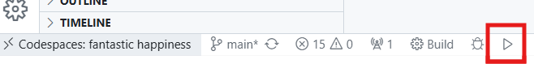

# Raylib Dev Container with noVNC

This repository demonstrates using a dev container to develop C++ apps using the raylib library.

The application is compiled as normal. The [light-weight desktop](https://github.com/devcontainers/features/tree/main/src/desktop-lite) (desktop-lite) dev container feature is used to allow development of GUI applications. It provides a web-based VNC viewer to view and interact with the GUI application being developed.

## Usage

Open the repository in VS Code using the dev container or using GitHub Codespaces.

Wait for the container to build and initialize.

Click the play button at the bottom of the editor to build and run the project.

When prompted, select the Clang compiler (if no compilers show up, scan for kits first, then try again).

Open the **Ports** tab and click the button to open in a browser.

This should load the noVNC page. You should be able to connect to the VNC server inside the container and see the running application.

You can also choose to open the page in the preview window within VS Code.
